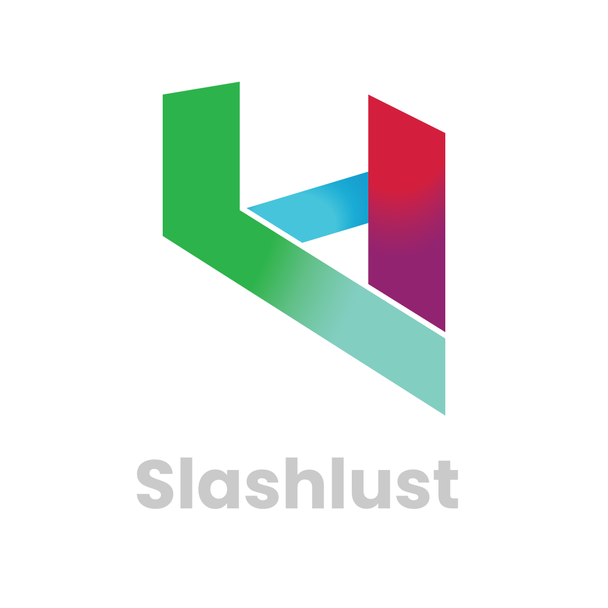

  

  <h3 style="text-align: center">Slashlust</h3>

  
Slash'em all

    

 

- [About](#about)
- [Built With](#built-with)
- [Getting Started](#getting-started)
  - [Prerequisites](#prerequisites)
- [Resources](#resources)
- [License](#license)
- [Members](#members)

## About 

 This project is being developed with the aim of putting into practice the knowledge acquired in different subjects of the college such as Mobile Development, Artificial Intelligence and Graphs. The main idea behind the project is to create a game following several guidelines passed by the teachers, the activity deliveries follow the Scrum model with Sprints containing mandatory evolutions of the work.

The team decided to make a game in the style of hack 'n slash with inspirations from several games of the genre.

## Built With

* Unity 2021.3.6f1 7da38d85baf6 - [Open with Unity Hub](unityhub://2021.3.6f1/7da38d85baf6)

## Getting Started

TODO: Getting started

### Prerequisites

* Unity 2021.3.6f1 7da38d85baf6 - [Open with Unity Hub](unityhub://2021.3.6f1/7da38d85baf6); 
* Visual Studio, Visual Studio Code or any other IDE; 
* For more info, [see system requirements](https://docs.unity3d.com/Manual/system-requirements.html); 

## Resources

* [tileable.co](https://tileable.co/)
* [textures.com](https://textures.com/)

## License

Distributed under the MIT License. See [LICENSE](https://github.com/Slashlust/slashlust/blob/main/LICENSE.md) for more information.

## Members

* **[Breno Lopes](https://github.com/zTrolly/)**
* **[Bruno Rodrigues](https://github.com/brunofaria27/)**
* **[Guilherme Dantas](https://github.com/Guilherme-Dantas/)**
* **[João Pedro Barroso](https://github.com/Saimom000/)**
* **[Laura Iara](https://github.com/mit018/)**
* **[Lucas Carvalho](https://github.com/Lucascluz/)**
* **[Lucas Vinícius](https://github.com/LucasVinicius314/)**
* **[Vinícius Henrique](https://github.com/viniciushgiovanini/)**
